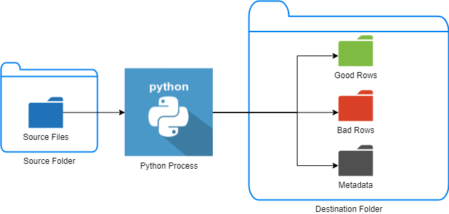
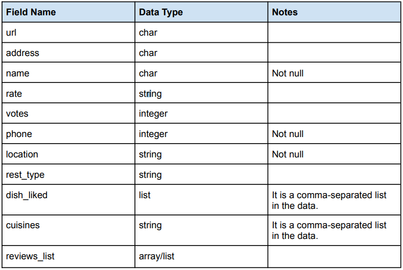
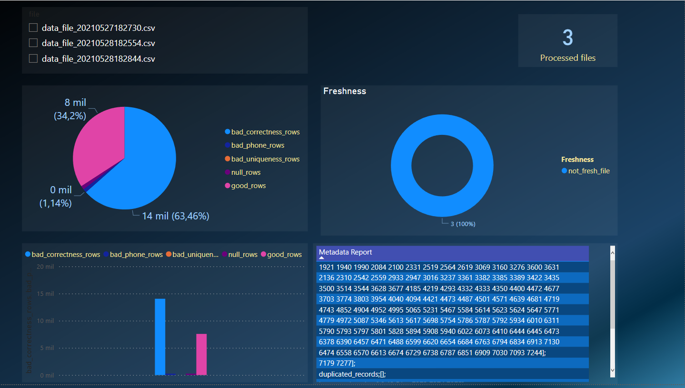

<div align="center">
 <b> Data Quality Engineer Code Test </b>

</div>

<div align="center">
<br />

[](https://github.com/Tecmaxmar)
  
</div>


<details open="open">
<summary>Index</summary>

- [Description](#Description)
- [Features](#Features)
- [Architecture](#Architecture)
- [Files Structure](#Files)
- [Dependencies](#Dependencies)
- [Dashboard](#Dashboard)
</details>

---
## Description

Zomato, an online food-ordering platform, receives data files daily which comprises data
regarding existing restaurants or new restaurants.

This program is a data processing/ingestion pipeline which runs daily to process these files and come up
with required output files.

## Features
### File Check Module

This module evaluates if the files were recently added in the source. It also looks for empty files and
 not csv files. These files should not be processed.

### Quality check Module
The Quality module cleans fields and check for invalid fields. This module also brings information about the processed files

- Clean symbols from descriptive fields
- Divide the Phone Column in two phone columns
- Cleans the '+' symbol and leading spaces on phone numbers
- Check that the phone structure is correct
- Check that the Location is listed on the "Areas_in_blore.csv" file.

### New Features


### Report Module
The report Module produces the reports, metadata and result files


## Architecture
<h1 align="center">  

</h1>

## Files Structure
<h1 align="center">  

</h1>

<br>


## Dependencies

All the necessary libraries must be detailed in the requirements.txt file for its correct operation and to install them locally in the terminal we do:

``` bash
pip install -r requirements.txt
```


## Dashboard

<h1 align="center">  

</h1>
<br>

